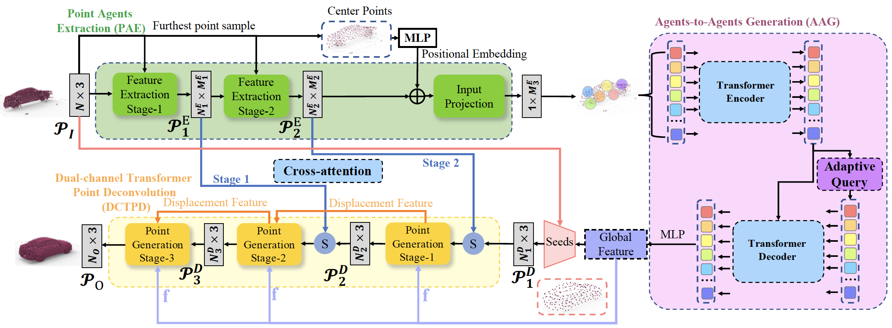

# DcTr: Noise-robust point cloud completion by dual-channel transformer with cross-attention

[[Paper]](https://www.sciencedirect.com/science/article/pii/S0031320322005313) [[Models]](#pretrained-models)

This repository contains PyTorch implementation for __DcTr: Noise-robust point cloud completion by dual-channel transformer with cross-attention__ (Pattern Recognition).

Current point cloud completion research mainly utilizes the global shape representation and local features to recover the missing regions of 3D shape for the partial point cloud. However, these methods suffer from inefficient utilization of local features and unstructured points prediction in local patches, hardly resulting in a well-arranged structure for points. To tackle these problems, we propose to employ Dual-channel Transformer and Cross-attention (CA) for point cloud completion (DcTr). The DcTr is apt at using local features and preserving a well-structured generation process. Specifically, the dual-channel transformer leverages point-wise attention and channel-wise attention to summarize the deconvolution patterns used in the previous Dual-channel Transformer Point Deconvolution (DCTPD) stage to produce the deconvolution in the current DCTPD stage. Meanwhile, we employ cross-attention to convey the geometric information from the local regions of incomplete point clouds for the generation of complete ones at different resolutions. In this way, we can generate the locally compact and structured point cloud by capturing the structure characteristic of 3D shape in local patches. Our experimental results indicate that DcTr outperforms the state-of-the-art point cloud completion methods under several benchmarks and is robust to various kinds of noise.



## Pretrained Models

We provide pretrained DcTr models:
| dataset  | url|
| --- | --- |  
| ShapeNet-55 |  [[Google Drive](https://drive.google.com/file/d/1RjDY5hu2Lv4WVp8Vwzgzj_V2985wHIGe/view?usp=share_link)] |
| ShapeNet-34 |  [[Google Drive](https://drive.google.com/file/d/1xz9zvgJu_qHhcYTrphKcpKQ6jFUbEKLD/view?usp=share_link)] |
| PCN |   [[Google Drive](https://drive.google.com/file/d/1ExGqBna7wKEV_V12f22KeDjSP8Qu8yfW/view?usp=share_link)]   |
| MVP |   [[Google Drive](https://drive.google.com/file/d/18MfoZqc3oPcicmUT5Gu4H3VkEgq5xNmm/view?usp=share_link)]   |

## Usage

### Requirements

- PyTorch >= 1.7.0
- python >= 3.7
- CUDA >= 9.0
- GCC >= 4.9 
- torchvision
- timm
- open3d
- tensorboardX

```
pip install -r requirements.txt
```

#### Building Pytorch Extensions for Chamfer Distance, PointNet++ and kNN

*NOTE:* PyTorch >= 1.7 and GCC >= 4.9 are required.

```
# Chamfer Distance
bash install.sh
# PointNet++
pip install "git+git://github.com/erikwijmans/Pointnet2_PyTorch.git#egg=pointnet2_ops&subdirectory=pointnet2_ops_lib"
# GPU kNN
pip install --upgrade https://github.com/unlimblue/KNN_CUDA/releases/download/0.2/KNN_CUDA-0.2-py3-none-any.whl
```

### Dataset

The details of our new ***ShapeNet-55/34*** datasets and other existing datasets can be found in [DATASET.md](./DATASET.md).

### Evaluation

To evaluate a pre-trained DcTr model on the Three Dataset with single GPU, run:

```
bash ./scripts/test.sh <GPU_IDS> --ckpts <path> --config <config> --exp_name <name> [--mode <easy/median/hard>]
```

####  Some examples:
Test the DcTr pretrained model on the PCN benchmark:
```
bash ./scripts/test.sh 0 --ckpts ./pretrained/DcTr_PCN.pth --config ./cfgs/PCN_models/DcTr.yaml --exp_name example
```
Test the DcTr pretrained model on ShapeNet55 benchmark (*easy* mode):
```
bash ./scripts/test.sh 0 --ckpts ./pretrained/DcTr_ShapeNet55.pth --config ./cfgs/ShapeNet55_models/DcTr.yaml --mode easy --exp_name example
```
Test the DcTr pretrained model on the KITTI benchmark:
```
bash ./scripts/test.sh 0 --ckpts ./pretrained/DcTr_KITTI.pth --config ./cfgs/KITTI_models/DcTr.yaml --exp_name example
```

### Training

To train a point cloud completion model from scratch, run:

```
# Use DistributedDataParallel (DDP)
bash ./scripts/dist_train.sh <NUM_GPU> <port> --config <config> --exp_name <name> [--resume] [--start_ckpts <path>] [--val_freq <int>]
# or just use DataParallel (DP)
bash ./scripts/train.sh <GPUIDS> --config <config> --exp_name <name> [--resume] [--start_ckpts <path>] [--val_freq <int>]
```
####  Some examples:
Train a DcTr model on PCN benchmark with 2 gpus:
```
CUDA_VISIBLE_DEVICES=0,1 bash ./scripts/dist_train.sh 2 13232 --config ./cfgs/PCN_models/DcTr.yaml --exp_name example
```
Resume a checkpoint:
```
CUDA_VISIBLE_DEVICES=0,1 bash ./scripts/dist_train.sh 2 13232 --config ./cfgs/PCN_models/DcTr.yaml --exp_name example --resume
```

Finetune a DcTr on PCNCars
```
CUDA_VISIBLE_DEVICES=0,1 bash ./scripts/dist_train.sh 2 13232 --config ./cfgs/KITTI_models/DcTr.yaml --exp_name example --start_ckpts ./weight.pth
```

Train a DcTr model with a single GPU:
```
bash ./scripts/train.sh 0 --config ./cfgs/KITTI_models/DcTr.yaml --exp_name example
```

We also provide the Pytorch implementation of several baseline models including GRNet, PCN, TopNet and FoldingNet. For example, to train a GRNet model on ShapeNet-55, run:
```
CUDA_VISIBLE_DEVICES=0,1 bash ./scripts/dist_train.sh 2 13232 --config ./cfgs/ShapeNet55_models/GRNet.yaml --exp_name example
```

### Completion Results on ShapeNet55 and KITTI-Cars


## License
MIT License

## Acknowledgements

Our code is inspired by [GRNet](https://github.com/hzxie/GRNet), [mmdetection3d](https://github.com/open-mmlab/mmdetection3d), [PoinTr](https://github.com/yuxumin/PoinTr) and [SnowflakeNet](https://github.com/AllenXiangX/SnowflakeNet).

## Citation
If you find our work useful in your research, please consider citing:
```
@article{fei2023dctr,
  title={DcTr: Noise-robust point cloud completion by dual-channel transformer with cross-attention},
  author={Fei, Ben and Yang, Weidong and Ma, Lipeng and Chen, Wen-Ming},
  journal={Pattern Recognition},
  volume={133},
  pages={109051},
  year={2023},
  publisher={Elsevier}
}
```
